# Security Lifecycle for Google using NSI


This document provides a comprehensive guide to leveraging the Network Security Integration (NSI) mirroring mode with Palo Alto Networks Software Firewalls. The primary objective is to enable organizations to perform a Security Lifecycle Review (SLR) on their existing Google Cloud environments.

**Key Objectives:**

1.  **Deploy with NSI Mirroring Mode:** Implement an out-of-band inspection model that mirrors network traffic to Palo Alto Networks Software Firewalls. This deployment method ensures zero disruption to live traffic and requires no architectural changes to the existing customer environment, allowing for a seamless integration with minimum effort.

2.  **Identify Security Risks and Posture:** Utilize the advanced threat detection capabilities of Palo Alto Networks to analyze the mirrored traffic. This process generates a Security Lifecycle Report (SLR) that provides deep visibility into the current security posture, identifying potential vulnerabilities, malware, data exfiltration risks, and other cyber threats present in the network.

3.  **Transition to Production with NSI Intercept Mode:** Armed with the insights from the SLR, organizations can effectively plan and execute a transition to the NSI *in-line* (intercept) mode. This production-ready configuration actively steers traffic through the firewalls, enforcing security policies to block threats and protect customer resources, thereby completing the journey from visibility to active protection. For the details steps, you can refer to [Deploy NSI intercept mode](https://github.com/PaloAltoNetworks/google-cloud-nsi-ui-demo) 

This tutorial details the deployment of these models within the [Network Security Integration](https://cloud.google.com/network-security-integration/docs/nsi-overview) (NSI) framework. NSI enables you to gain visibility and security for your VPC network traffic, without requiring any changes to your network infrastructure.

The functionality of each model is summarized as follows:

| Model           | Description             |
| --------------- | ----------------------- |
| **Out-of-Band** | Uses packet mirroring to forward a copy of network traffic to Software Firewalls for *out-of-band* inspection. Traffic is mirrored to your software firewalls by creating mirroring rules within your network firewall policy. |
| **In-line**     | Uses packet intercept to steer network traffic to Software Firewalls for *in-line* inspection. Traffic is steered to your software firewalls by creating firewall rules within your network firewall policy. |

This tutorial is intended for network administrators, solution architects, and security professionals who are familiar with [Compute Engine](https://cloud.google.com/compute) and [Virtual Private Cloud (VPC) networking](https://cloud.google.com/vpc).


<br>

## Architecture

NSI follows a *producer-consumer* model, where the *consumer* consumes services provided by the *producer*. The *producer* contains the cloud infrastructure responsible for inspecting network traffic, while the *consumer* environment contains the cloud resources that require inspection.


### Producer Components

The producer creates firewalls which serve as the backend service for an internal load balancer. For each zone requiring traffic inspection, the producer creates a forwarding rule, and links it to an *intercept* or *mirroring* *deployment* which is a zone-based resource. These are consolidated into an *deployment group*, which is then made accessible to the consumer.

| Component | Description |
| :---- | :---- |
| [Load Balancer](https://cloud.google.com/network-security-integration/docs/out-of-band/configure-producer-service#create-int-lb-pm) | An internal network load balancer that distributes traffic to the NGFWs. |
| [Deployments](https://cloud.google.com/network-security-integration/docs/out-of-band/deployments-overview) | A zonal resource that acts as a backend of the load balancer, providing network inspection on traffic from the consumer. |
| [Deployment Group](https://cloud.google.com/network-security-integration/docs/out-of-band/deployment-groups-overview) | A collection of intercept or mirroring deployments that are set up across multiple zones within the same project.  It represents the firewalls as a service that consumers reference. |
| [Instance Group](https://cloud.google.com/compute/docs/instance-groups) | A managed or unmanaged instance group that contains the firewalls which enable horizontal scaling. |


<br>

### Consumer Components

The consumer creates an *intercept* or *mirroring* *endpoint group* corresponding to the producer's *deployment group*. Then, the consumer associates the endpoint group with VPC networks requiring inspection. 

Finally, the consumer creates a network firewall policy with rules that use a *security profile group* as their action.  Traffic matching these rules is intercepted or mirrored to the producer for inspection.

| Component | Description |
| :---- | :---- |
| [Endpoint Group](https://cloud.google.com/network-security-integration/docs/out-of-band/endpoint-groups-overview) | A project-level resource that directly corresponds to a producer's deployment group. This group can be associated with multiple VPC networks. |
| [Endpoint Group Association](https://cloud.google.com/network-security-integration/docs/out-of-band/configure-mirroring-endpoint-group-associations) | Associates the endpoint group to consumer VPCs. |
| [Firewall Rules](https://cloud.google.com/firewall/docs/network-firewall-policies) | Exists within Network Firewall Policies and select traffic to be intercepted or mirrored for inspection by the producer. |
| [Security Profiles](https://cloud.google.com/network-security-integration/docs/security-profiles-overview) | Can be type `intercept` or `mirroring` and are set as the action within firewall rules. |

<br>

### Traffic Flow Example

The network firewall policy associated with the `consumer-vpc` contains two rules, each specifying a security profile group as their action. When traffic matches either rule, the traffic is encapsulated to the producer for inspection. 

<table>
  <tr>
    <!-- Title cell with left alignment -->
    <th colspan="5" align="center">Network Firewall Policy</th>
  </tr>
    <tr>
        <th>PRIORITY</th>
        <th>DIRECTION</th>
        <th>SOURCE</th>
        <th>DESTINATION</th>
        <th>ACTION</th>
    </tr>
    <tr>
        <td><code>10</code></td>
        <td><code>Egress</code></td>
        <td><code>0.0.0.0/8</code></td>
        <td><code>0.0.0.0/0</code></td>
        <td><code>apply-security-profile</code></td>
    </tr>
    <tr>
        <td><code>11</code></td>
        <td><code>Ingress</code></td>
        <td><code>0.0.0.0/0</code></td>
        <td><code>0.0.0.0/8</code></td>
        <td><code>apply-security-profile</code></td>
    </tr>
</table>

> [!NOTE]
> In the *out-of-band* model, traffic would be mirrored to the firewalls instead of redirected.  


#### Traffic to Producer
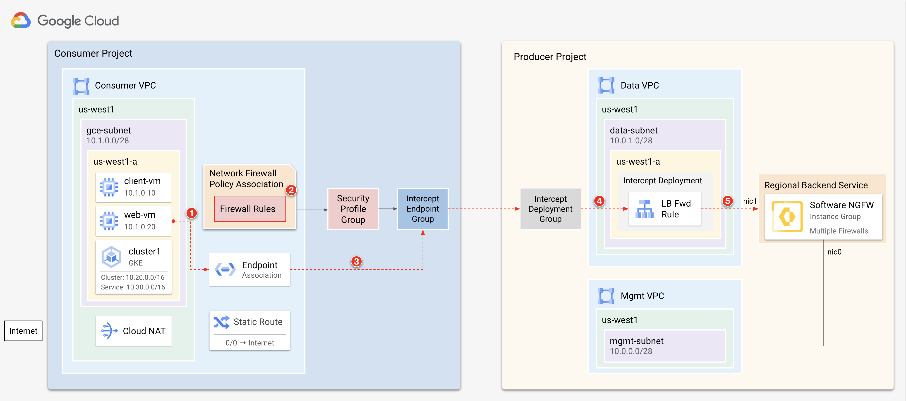

1. The `web-vm` makes a request to the internet. The request is evaluated against the rules within the Network Firewall Policy associated with the `consumer-vpc`.
2. The request matches the `EGRESS` rule (priority: `10`) that specifies a security profile group as its action.
3. The request is then encapsulated and mirrored through the `endpoint association` to the producer environment.
4. Within the producer environment, the `intercept deployment group` mirror the traffic to the `intercept deployment` located in the same zone as the `web-vm`.
5. The internal load balancer forward the traffic to an available firewall for deep packet inspection.

#### Traffic from Producer
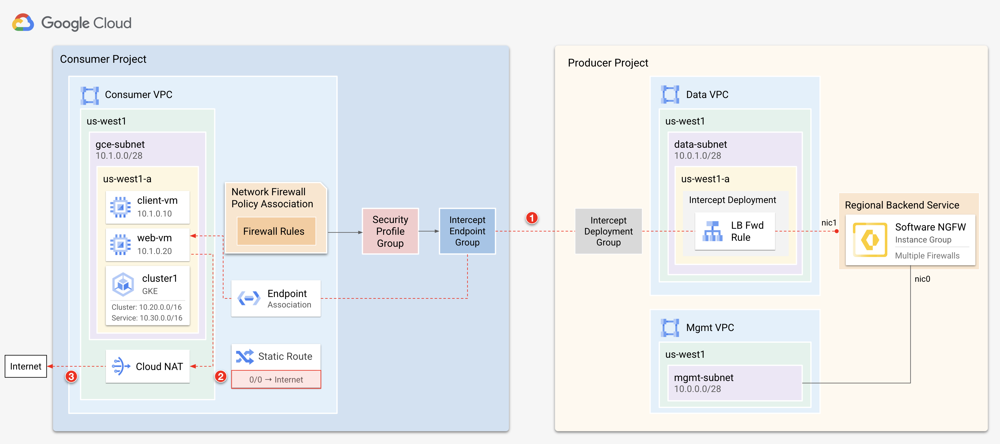

1. If the firewall permits the traffic, it is returned to the `web-vm` via the consumer's `endpoint association`. (This is only for In-Line mode, for out-of-band mode this will not happen, the original traffic will flow as usual)
2. The local route table of the `consumer-vpc` routes traffic to the internet via the Cloud NAT.
3. The session is established with the internet destination and is continuously monitored by the firewall. 

---

<br>

## Requirements


1. Two Google Cloud projects (Producer and Consumer).
2. Access to [Cloud Shell](https://shell.cloud.google.com). 
3. The following IAM Roles:

    | Ability | Scope | Roles |
    | :---- | :---- | :---- |
    | Create [firewall endpoints](https://cloud.google.com/firewall/docs/about-firewall-endpoints#iam-roles), [endpoint associations](https://cloud.google.com/firewall/docs/about-firewall-endpoints#endpoint-association), [security profiles](https://cloud.google.com/firewall/docs/about-security-profiles#iam-roles), and [network firewall policies](https://cloud.google.com/firewall/docs/network-firewall-policies#iam). | Organization | `compute.networkAdmin`<br>`compute.networkUser`<br>`compute.networkViewer` |
    | Create [global network firewall policies](https://cloud.google.com/firewall/docs/use-network-firewall-policies#expandable-1) and [firewall rules](https://cloud.google.com/firewall/docs/use-network-firewall-policies#expandable-8) for VPC networks. | Project | `compute.securityAdmin`<br>`compute.networkAdmin`<br>`compute.networkViewer`<br>`compute.viewer`<br>`compute.instanceAdmin` |


<br>

## Create Producer Environment
In the `producer` directory, use the terraform plan to create the producer's VPCs, instance template, instance group, internal load balancer, intercept deployment, and intercept deployment group. 

> [!TIP]
> In production environments, it is recommended to deploy the producer resources to a dedicated project.  This ensures the security services are managed independently of the consumer.

> [!CAUTION]
> It is required to make your cloudshell git support large file download, run below command to install git lfs before you start to clone the source code.

    sudo apt install git-lfs

And ensure you enabled the necessary API services in your Producer project. Run below commands before you start the terraform build.

    gcloud services enable \
    cloudresourcemanager.googleapis.com \
    compute.googleapis.com \
    iam.googleapis.com \
    networksecurity.googleapis.com


1. In [Cloud Shell](https://shell.cloud.google.com), clone the repository change to the `producer` directory. 

    ```
    git clone https://github.com/PaloAltoNetworks/google-cloud-nsi-security-lifecycle.git
    cd google-cloud-nsi-security-lifecycle/producer
    ```

2. Create a `terraform.tfvars`.

    ```
    cp terraform.tfvars.example terraform.tfvars
    ```

3. Edit `terraform.tfvars` by setting values for the following variables:  
   
    | Key | Value | Default |
    | :---- | :---- | :---- |
    | `project_id` | The Google Cloud project ID of the producer environment. | `null` |
    | `mgmt_allow_ips` | A list of IPv4 addresses which have access to the firewall's mgmt interface. | `["0.0.0.0/0"]` |
    | `mgmt_public_ip` | If true, the management address will have a public IP assigned to it. | `false` | 
    | `region` | The region to deploy the consumer resources. | `us-west1` |
    | `image_name` | The firewall image to deploy. | `vmseries-flex-bundle2-1126`|
    | `mirroring_mode` | If true, configures the forwarding rule for packet mirroring. If false, configures it for in-band traffic. | `true` |

> [!CAUTION]
> It is recommended to set `mgmt_public_ip` to `false` in production environments.

> [!TIP]
> For `image_name`, a full list of public images can be found with this command:
> ```
> gcloud compute images list --project paloaltonetworksgcp-public --no-standard-images
> ```
> All NSI deployments require PAN-OS 11.2.x or greater.

> [!NOTE]
> If you are using BYOL image (i.e.  <code>vmseries-flex-<b>byol</b>-*</code>), the license can be applied during or after deployment.  To license during deployment, add your authcode to `bootstrap_files/authcodes`.  See [Bootstrap Methods](https://docs.paloaltonetworks.com/vm-series/11-1/vm-series-deployment/bootstrap-the-vm-series-firewall) for more information.  


4. Initialize and apply the terraform plan.

    ```
    terraform init
    terraform apply
    ```

    Enter `yes` to apply the plan.

5. After the apply completes, terraform displays the following message:

    <pre>
    export <b>PRODUCER_PROJECT</b>=<i>your-project-id</i>
    export <b>DATA_VPC</b>=<i>nsi-data</i>
    export <b>DATA_SUBNET</b>=<i>us-west1-data</i>
    export <b>REGION</b>=<i>us-west1</i>
    export <b>ZONE</b>=<i>us-west1-a</i>
    export <b>BACKEND_SERVICE</b>=<i>https://www.googleapis.com/compute/v1/projects/your-project-id/regions/us-west1/backendServices/panw-nsi-lb</i></pre>


> [!IMPORTANT] 
> The `init-cfg.txt` includes `plugin-op-commands=geneve-inspect:enable` bootstrap parameter, allowing firewalls to handle GENEVE encapsulated traffic forwarded via packet intercept or packet mirror. 
> If this is not configured, packet intercept/mirror traffic will be dropped. 

## Create Consumer Environment

> [!NOTE] 
> This is not required if assessment customer existing environmenat, and this consumer environment is just for the demo purpose.

In the `consumer` directory, use the terraform plan to create a consumer environment. The terraform plan creates a VPC (`consumer-vpc`) , two debian VMs (`client-vm` & `web-vm`), and a GKE cluster (`cluster1`) (optinal).

> [!NOTE]
> If you already have an existing consumer environment, skip to [Create Intercept Endpoint Group](#create-intercept-endpoint--endpoint-group).

Set to Consumer project

```
export CONSUMER_PROJECT="<your consumer project>" ### replace with consumer project
```

Switch to Consumer project
```
gcloud config set project $CONSUMER_PROJECT
```

And ensure you enabled the necessary API services in your Comsumer project. Run below commands before you start the terraform build.

    gcloud services enable \
    cloudresourcemanager.googleapis.com \
    compute.googleapis.com \
    iam.googleapis.com \
    networksecurity.googleapis.com \
    secretmanager.googleapis.com

1. In Cloud Shell, change to the `consumer` directory.

    ```
    cd
    cd google-cloud-nsi-security-lifecycle/consumer
    ```

2. Create a `terraform.tfvars`

    ```
    cp terraform.tfvars.example terraform.tfvars
    ```

3. Edit `terraform.tfvars` by setting values for the following variables:  
   

    | Variable | Description | Default |
    | :---- | :---- | :---- |
    | `project_id` | The project ID of the consumer environment. | `null` |
    | `mgmt_allowed_ips` | A list of IPv4 addresses that can access the VMs on `TCP:80,22`. | `["0.0.0.0/0"]` |
    | `region` | The region to deploy the consumer resources. | `us-west1` |
    | `create_gke` | Whether to create the GKE cluster. | `false` |

4. Initialize and apply the terraform plan.

    ```
    terraform init
    terraform apply
    ```

    Enter `yes` to apply the plan.

5. After the apply completes, terraform displays the following message:

    <pre>
    export <b>CONSUMER_PROJECT</b>=<i>your-project-id</i>
    export <b>CONSUMER_VPC</b>=<i>consumer-vpc</i>
    export <b>REGION</b>=<i>us-west1</i>
    export <b>ZONE</b>=<i>us-west1-a</i>
    export <b>CLIENT_VM</b>=<i>client-vm</i>
    export <b>CLUSTER</b>=<i>cluster1</i>
    export <b>ORG_ID</b>=<i>$(gcloud projects describe your-project-id --format=json | jq -r '.parent.id')</i></pre>

<br>
<br>

# On the Producer Project


> [!NOTE]
> For the Security Lifecycle Assessment, we will use **mirror** mode of the NSI. We will not **block** any traffic, the purpose is to understand if there are any existing security issues or risks.


## Create NSI Deployment Group:

1. Navigate to Network Security \-\> Deployment groups, and select "Create deployment group." Configure the settings as follows:

    * **Name:** `nsi-demo-deployment-group` (Or a preferred, descriptive name)  
    * **Network:** `nsi-data` (Pre-provisioned by the Terraform template; this is the location of the NGFW data network)  
    * **Purpose:** `NSI Out-of-Band` (Mirror modes)  
      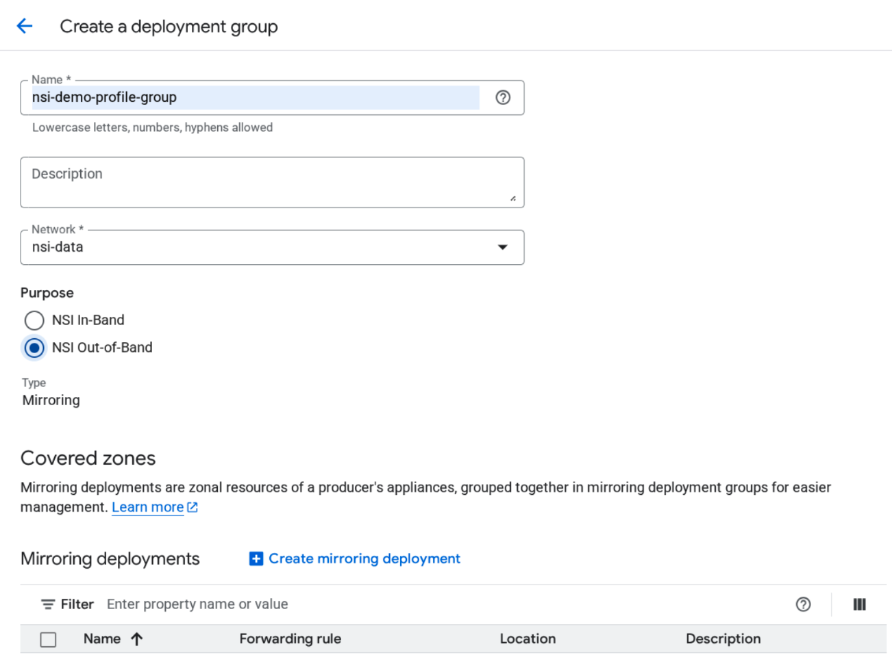


2. Select "Create mirroring deployment" and configure the settings:

    * **Name:** `nsi-demo-deployment`  
    * **Region:** `us-west1`  
    * **Zone:** `us-west1-a`  
    * **Load balancer:** `nsi-panw-lb`  
    * **Forwarding rule:** `nsi-panw-lb-rule` (The rule created by terraform, it should be auto-selected after you selected the load balancer)

    **Note:** The preceding steps may be replicated to create multiple intercept deployments for individual zones, should the protection of resources across various zones be required. For the purpose of this demonstration, interception is enabled exclusively for resources within the `us-west1-a` zone.

    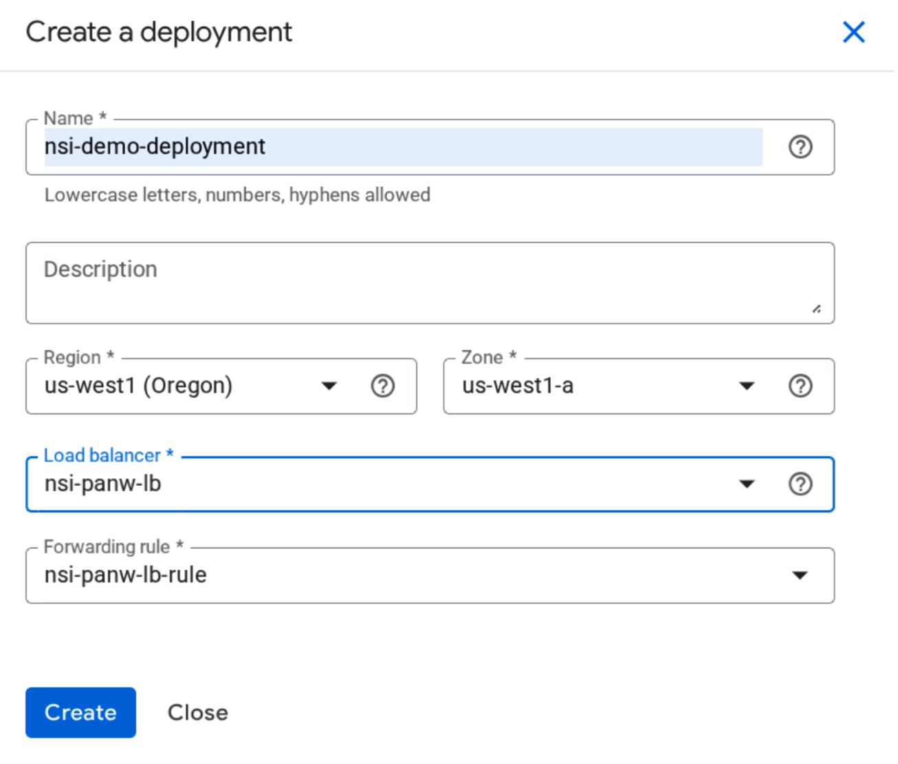

3. Select "Create" to proceed.

    After a short waiting period, the intercept deployment's status should transition to "Active." This concludes the configuration within the Producer project. The process now continues with the Consumer project, where the protected resources reside.On the Consumer ProjectCreation of Intercept Endpoint & Endpoint Group

    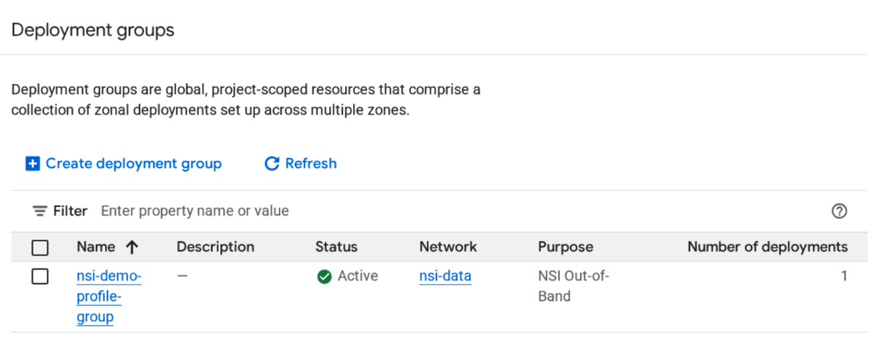

# On the Consumer project

## Create Intercept Endpoint & Endpoint Group

1. Navigate to Network Security \-\> Endpoint groups, and select "Create endpoint group." Configure the settings as follows:

    * **Name:** `nsi-demo-epg`  
    * **Purpose:** NSI Out-of-Band (For mirroring)

2. For the **Deployment group**, click **Select Project**, and Select the Producer Project, and find the Deployment Group created previously by Terraform


    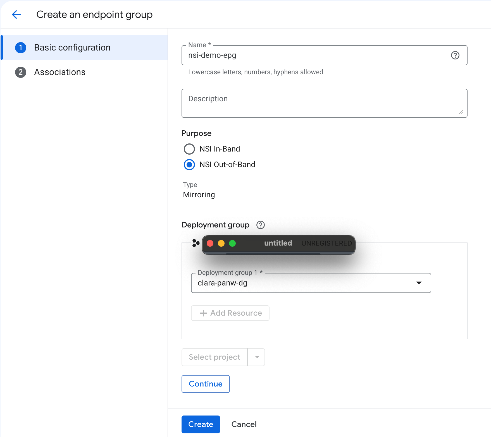

3. Select "Continue." In the "Associations" section, select "Add endpoint group association." Configure the settings as follows:

    * **Project:** `<the name of the consumer project>` (Ensure that the Compute Engine API and Network Security API are enabled)  
    * **Network:** `consumer-vpc` (The VPC containing the resources to be protected; this VPC was pre-created by the Terraform template)

4. Select "Done" upon completion.

    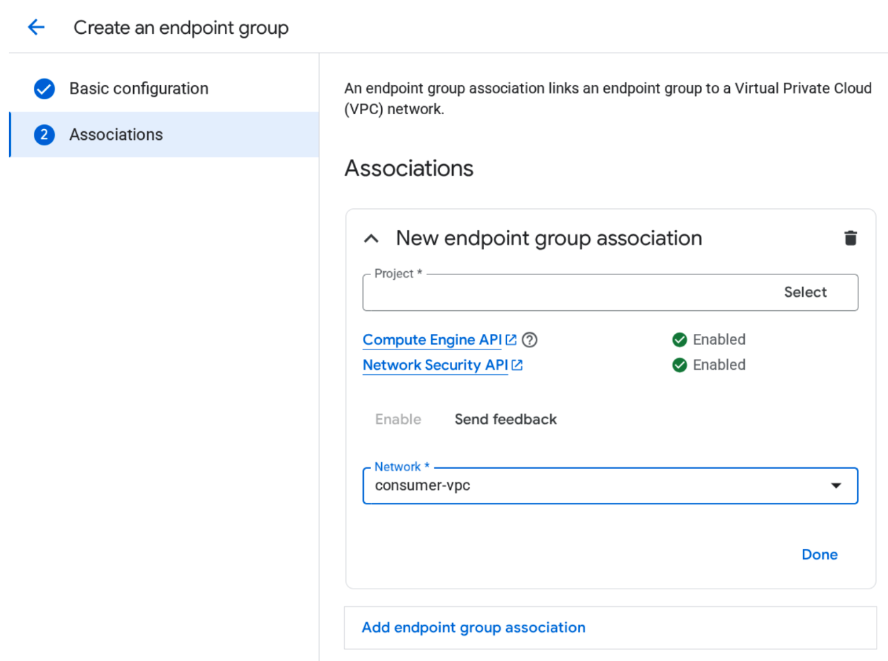

5. Select "Create" to provision the endpoint group.

    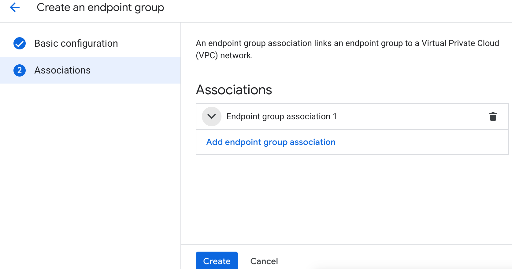

6. Allow a brief period for the configuration to take effect, and the endpoint group's status should indicate "Active."Creation of Security Profile and Security Profile Group

    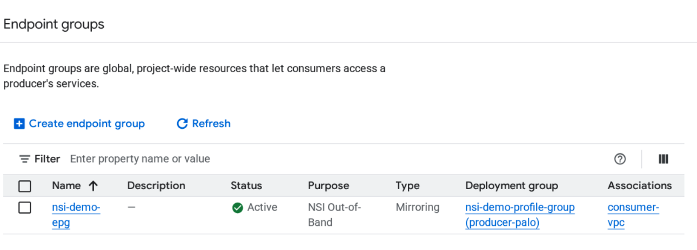

## Create the Security Profile and Security Profile Group

**Note:** Completion of the following steps requires the Org-level permissions outlined at the beginning of the documentation.

1. Navigate to Networks Security \-\> Common components \-\> Security profiles, switch the UI to the customer Org level and select "Create Security profile." Configure the settings as follows:

    * **Name:** `nsi-demo-profile`  
    * **Purpose:** NSI Out-of-Band  
    * **Traffic directed to:**  
      * **Project:** `<Consumer project ID>`  
      * **Endpoint group:** `nsi-demo-epg` (The endpoint group configured previously in the consumer project)

2. Select "Create."

    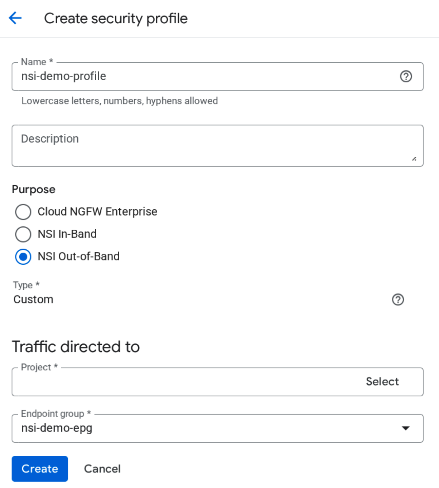

3. Select the "Security profile groups" tab, and select "Create profile group."

    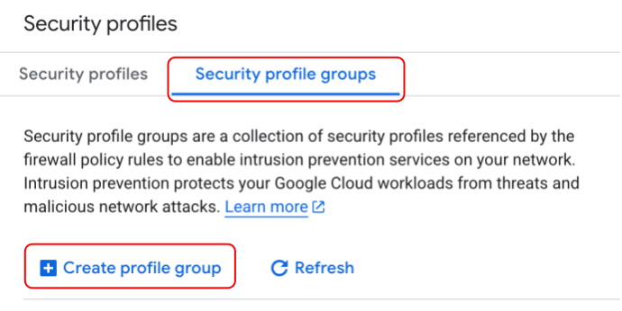

4. Configure the settings as follows:

    * **Name:** `nsi-demo-profile-group`  
    * **Purpose:** NIS Out-of-Band  
    * **Custom mirroring profile:** `nsi-demo-profile` (The security profile created in the preceding step)

5. Select "Create."  
    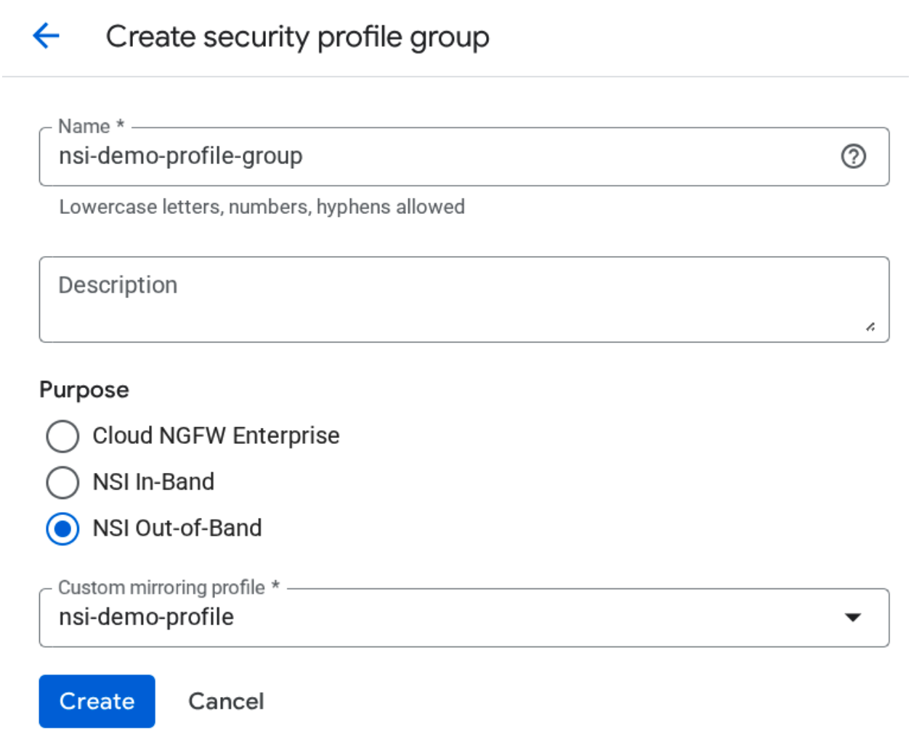

## Create Firewall Rules

1. Switch to the **Consumer project**, navigate to Cloud NGFW \-\> Firewall policies, and select "Create firewall policy." Configure the settings as follows:

    * **Policy Name:** `nsi-demo-consumer-policy`  
    * **Policy Type:** VPC policy  
    * **Deployment scope:** Global

2. Select "Continue."

    * In the **Add rules** section, we don't need to configure that, as we are doing mirroring traffic not intercept, just click "Continue"

    * In the **Add mirroring rules** Select "Create mirroring rule." (Two mirroring rules are required: one for egress to destination `0.0.0.0/0` and one for ingress from source `0.0.0.0/0`, with the action set to apply the security profile group created for NSI Out-of-Band.)

      * **Ingress rule:**  
        * **Priority:** 10  
        * **Direction of traffic:** Ingress  
        * **Action on match:** Mirror  
          * **Security profile group:** `nsi-demo-profile-group`  
        * **Source filters:** IPv4: `0.0.0.0/0`  
        * All other settings should remain at their default values.  
      * **Egress rule:**  
        * **Priority:** 11  
        * **Direction of traffic:** Egress  
        * **Action on match:** Mirror  
          * **Security profile group:** `nsi-demo-profile-group`  
        * **Destination filters:** IPv4: `0.0.0.0/0`  
        * All other settings should remain at their default values.
3. Click "Continue" **before moving onto Step 3 “Associate policy with networks”.**
    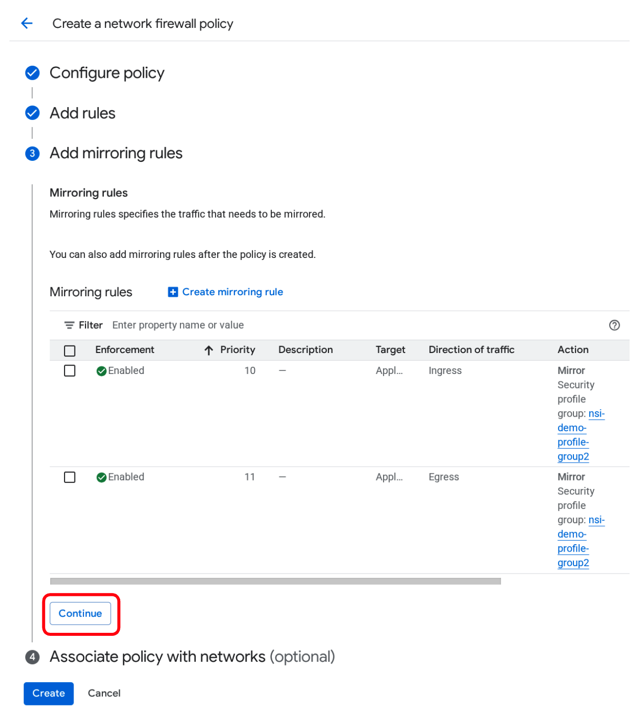

3. In the **Associate policy with networks** section, select "Associate." Select the `consumer-vpc` and select "Associate."  
    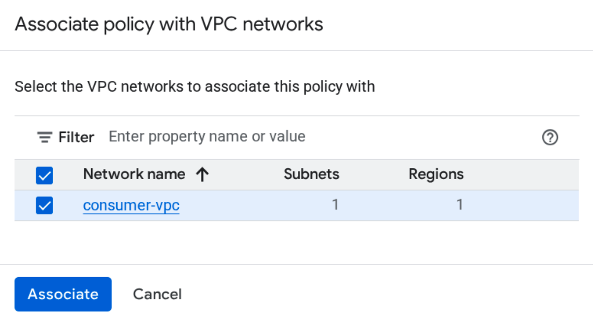  
</br>
4. Select "Create." 

---

# Security Lifecycle Report Generation

## Export logs from VM-Series Firewall endpoint

* (Optional, if you are using Bastion Host for remote access, you would need the below steps for IAP tunnel access)***Setup the access to the firewall managment console***
  * ***Switch to Producer Project***
    ```
    export PRODUCER_PROJECT="<your producer project>" ###replace with producer project
    gcloud config set project $PRODUCER_PROJECT
    ```
  * ***In Your local laptop, get the firewall’s management IP address and build the access to the firewall through the bastion host and IAP-Tunnel. Notice: The local proxy port is set to 8081 by default, if you want to use another port, you can update the script below in last line:***
>[!CAUTION]
> Please run the script below on your local laptop with the gcloud CLI installed. Ensure that the terminal remains open until you have completed accessing the firewall, as the proxy tunnel will terminate if the terminal session is closed.

    ```
    output=$(gcloud compute instances list --filter="name:bastion" --project=$PRODUCER_PROJECT --format="value(name,zone)")
    export BASTION_NAME=$(echo "$output" | awk '{print $1}')
    export BASTION_ZONE=$(echo "$output" | awk '{print $2}')

    export MGMT_ADDRESS=$(gcloud compute instances list \
    --filter="name ~ panw-firewall" \
    --format="value(networkInterfaces[0].networkIP)")

    gcloud compute ssh $BASTION_NAME \
    --tunnel-through-iap \
    --zone=$BASTION_ZONE \
    -- -N -L 8081:$MGMT_ADDRESS:443
    ```

  * ***Access the web management console using your browser, if you see a warning for invalid certificate, should be good, as in the demo environment it's using self-signed certifcate, just click "proceed" (If you have multiple FW instances in the instance group, you would need to repeat below steps to get all the logs for individual FW instance)***

    ***If you are using Bastion Host:***
    ```
    https://127.0.0.1:8081
    ```
    ***If you are have assigned public IP address to the Management Interface of NGFW, direct access the public IP as below:***
    ```
    https://<Public_IP_MGMT_Interface>
    ```
    ***Username:*** ```admin```

    ***Password:*** ```PaloAlto@123```

> [!NOTE]
> It is not a good practise to hardcode password in the NGFW instance, here is just for demo purpose and ease the steps of configuration. Highly recommand you set complex password during the intial setup of the firewall instance.

</br>


  * ***Download the NGFW Stats Dump file (only 7-days traffic available through the UI). Navigate to Device ->Support -> Stats Dump File, click "Generate Stats Dump File"***

    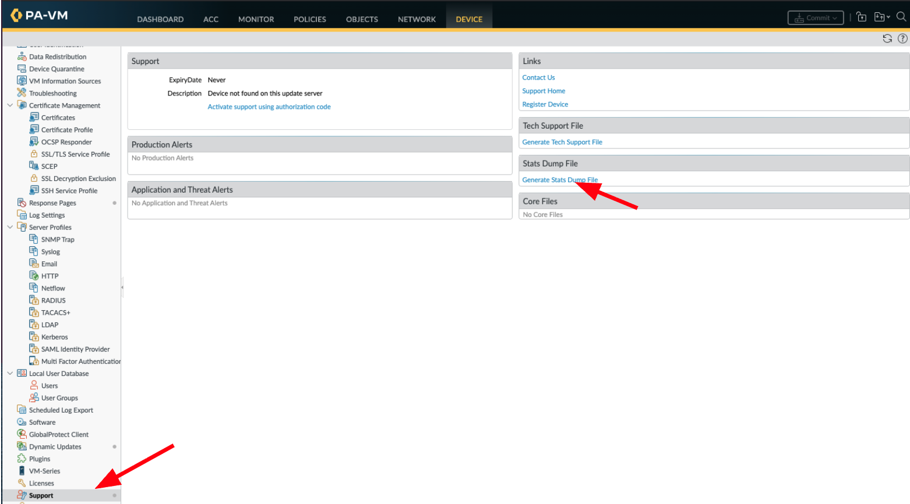

  * ***(Optional)Your can generate longer period of data (if you need more than 7 days logs) from the VM-Series using CLI: (you would need to host a SCP server in your environemt to export the log)***

    ```
    scp export stats-dump start-time equal <YYYY/MM/DD@HH:MM:SS> end-time equal <YYYY/MM/DD@HH:MM:SS> to <username>@<scp-server-ip>:<file-path>
    ```
> [!NOTE]
> Please check back in 7 days (by default, or the x days you like using the scp to export more logs as described in the previous steps), and download the NGFW Stats Dump file. Because if you continue and generate the report now, it would have enough log amount at this moment.

## Generate the SLR (Security Lifecycle Report) 

*   If you don't have an existing account, register at [Link](https://support.paloaltonetworks.com/Home/Register).
    * You would need to register the VM Series NGFW to the new account creation
      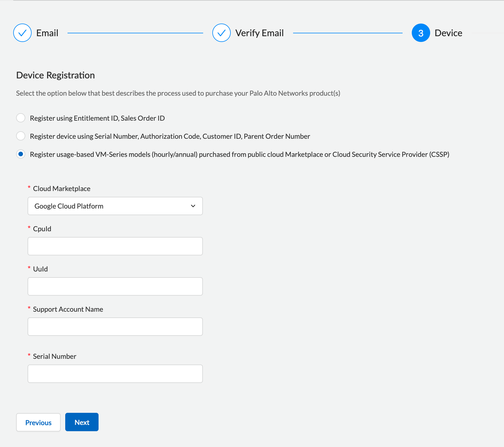
    * You can get the CpuId, Uuid, Serieal Number in the UI console of the NGFW (as previous step)
      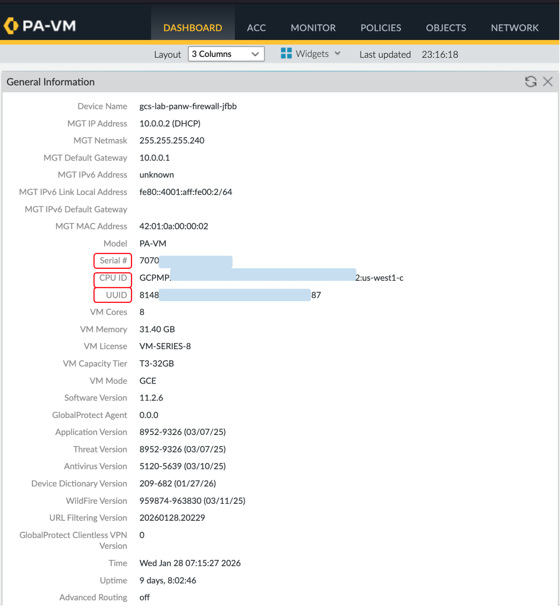

*   Access the CSP (Customer support portal) at URL: https://support.paloaltonetworks.com/Support/Index     
    After login with your Navigate to **Resources** -> **Security Lifecycle Review**

    * ***Input Account Information:***

      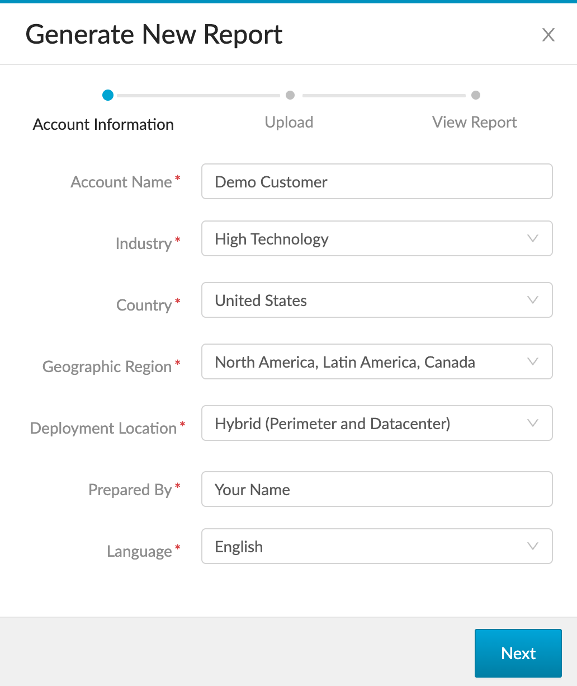

    * ***Upload the stats dump file you downloaded in previous steps, support multi-files upload.***

      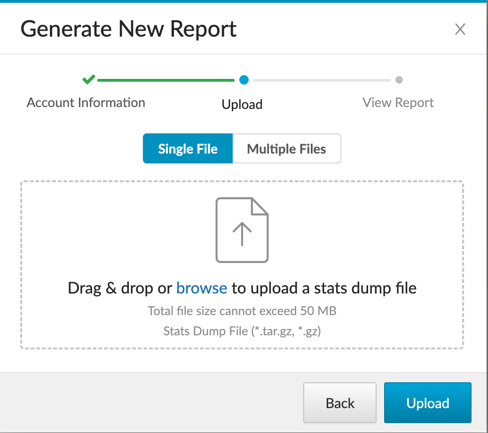

    * ***You will see below screens when the report generating***
      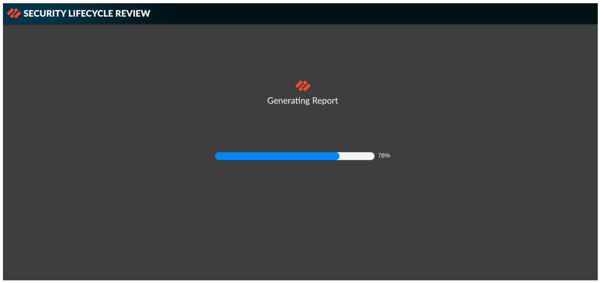
      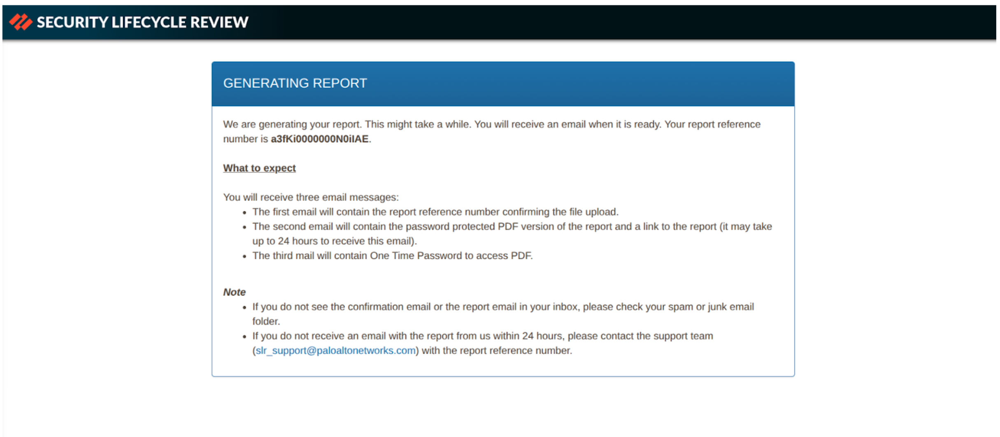

    * ***You can customize the report and download the report as PDF***

      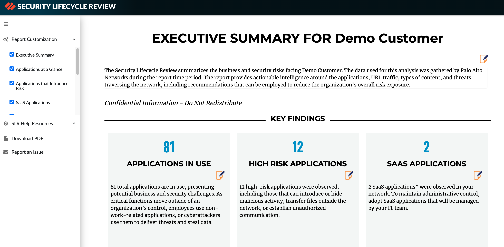

      </br>

      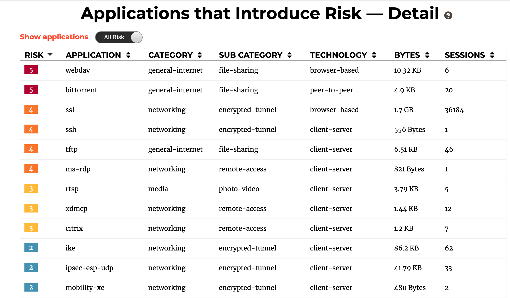

      </br>

      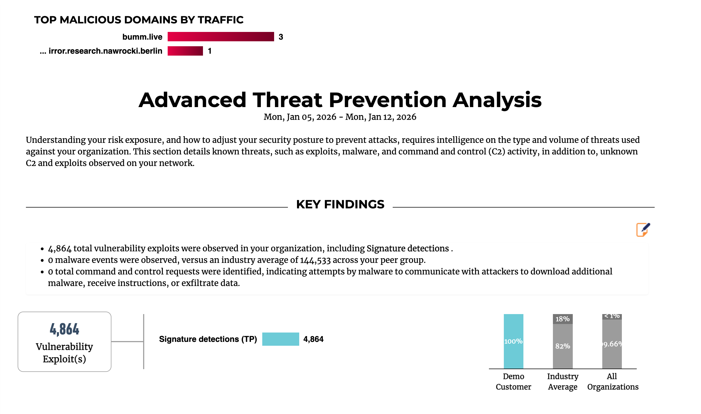


</br>
</br>

# (Optional) Deletion

## On the Consumer Project:

Navigate to Network Security \-\> Cloud NGFW \-\> Firewall policies.

Locate the Network firewall policy created by name.

* ***Remove the firewall policy associations.***

  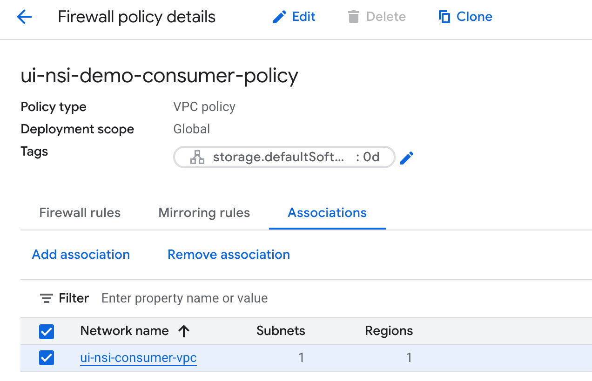

* ***Delete the Firewall policy.***

  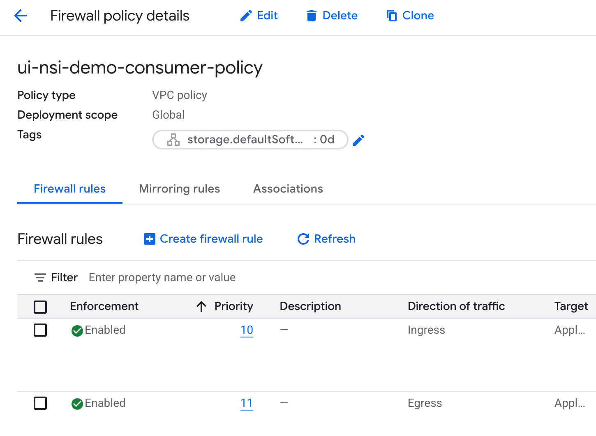

* ***Delete the Security Profile Group and Security Profile (Org-level permission is required).***

  * Navigate to Network Security \-\> Common components \-\> Security profiles \-\> Security profile groups.

    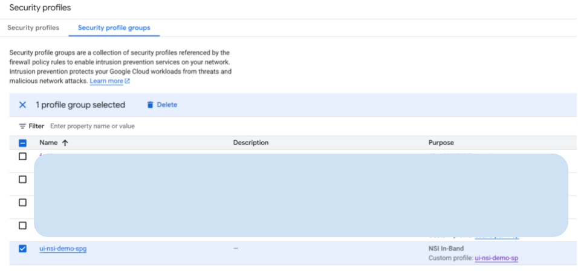


    Select and delete the security profile group created.

  * Navigate to Network Security \-\> Common components \-\> Security profiles.

    Select and delete the security profiles created.

    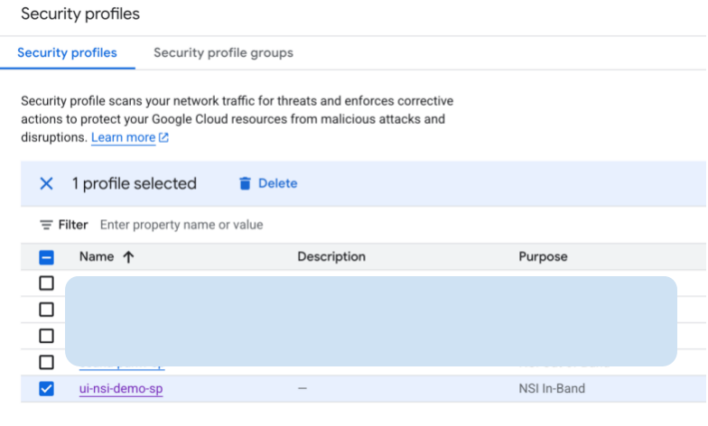

* ***Navigate to Network Security \-\> Cloud NSI \-\> Endpoint groups. Select the created endpoint group, select the association created, and delete it. (The association must be removed prior to deleting the endpoint group.) Subsequently, delete the endpoint group.***

  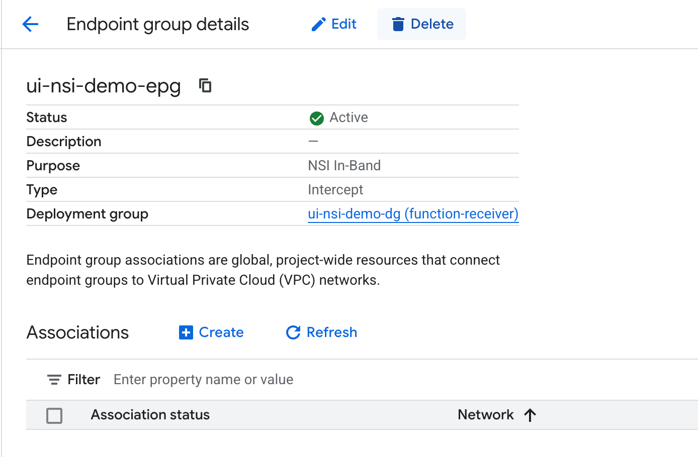


* Run `terraform destroy` from the `consumer` directory.

    ```
    cd
    cd google-cloud-nsi-security-lifecycle/consumer
    terraform destroy
    ```

* Enter `yes` to delete all consumer resources.

</br>

## On the Producer Project:

* ***Navigate to Network Security \-\> Cloud NSI \-\> Deployment groups. Select the created deployment group. Select the intercept deployment endpoint, and delete it.***

  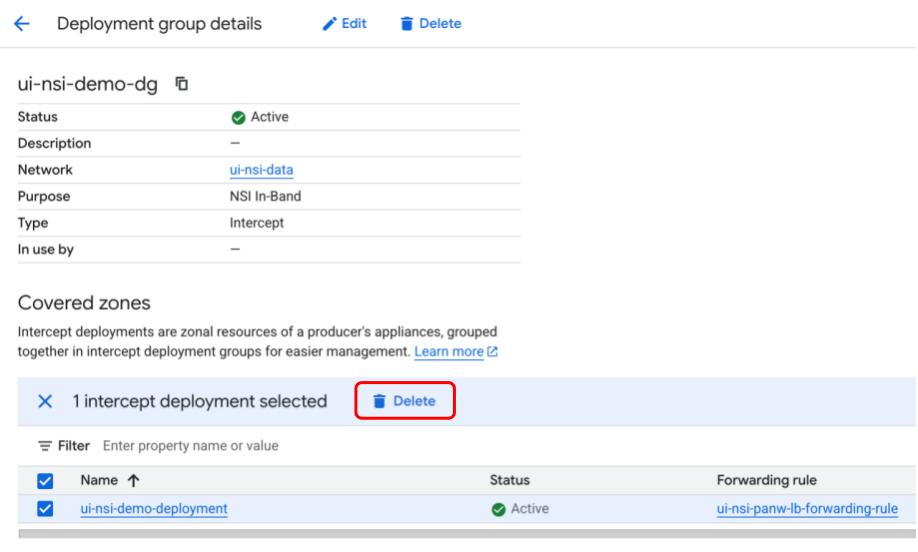

* ***The deployment group may now be deleted.***

  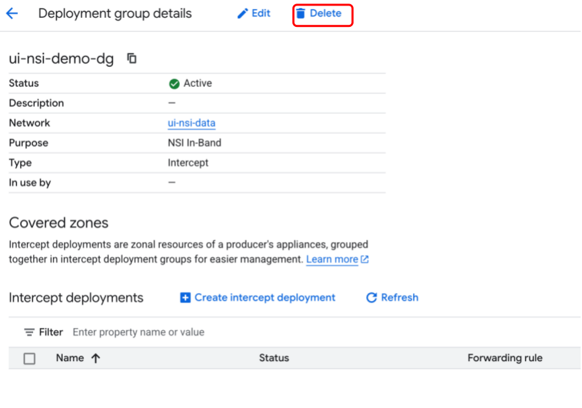

* ***Run `terraform destroy` from the `/producer` directory.***

    ```
    cd
    cd google-cloud-nsi-security-lifecycle/producer
    terraform destroy
    ```

* ***Enter `yes` to delete all producer resources.***
